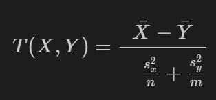

## A/B тестирование
Рассмотрим A/B тестирование на примере сайта.
У сайта есть два дизайна - старый и новый, и мы хотим оценить, насколько новый дизайн лучше старого. 
Для этого пользователи сайта случайным образом разделяются на контрольную и тестовую группы. 
Контрольной группе показывается старая версия сайта, тестовой группе - измененная версия. 
Оценить изменение можно несколькими способами, самый простой - оценить конверсию. 
Конверсия - доля пользователей, совершивших заранее определенное действие(например подписка, нажатие на кнопку, заполнение формы).

## Описание данных
Для начала нужно загрузить данные из файла `a_b_testing.csv`. 
В данном случае 1 - была совершена подписка на сайт, 0 - подписки не было. A - контрольная группа, B - тестовая группа.

## Задача
Найдите доверительный интервал для средней конверсии пользователей из контрольной выборки с уровнем значимости 95%. 
Округлите левую и правую границу с точностью до двух знаков после запятой. 
Запишите значения левой и правой границ через запятую, сохраняя приведенный порядок, в переменную `answer1`, которая будет являтся строкой.
Найдите значение статистики Стьюдента в предположении независимости выборок по формуле:

где `n` - размер контрольной выборки, `m`  - размер тестовой выборки.
Ответ запишите в переменную `answer2` с точностью до двух знаков после запятой.

Найдите p-value для статистики Стьюдента, используя функцию `stats.ttest_ind`.
Ответ запишите в переменную `answer3` с точностью до 2 знака после запятой
